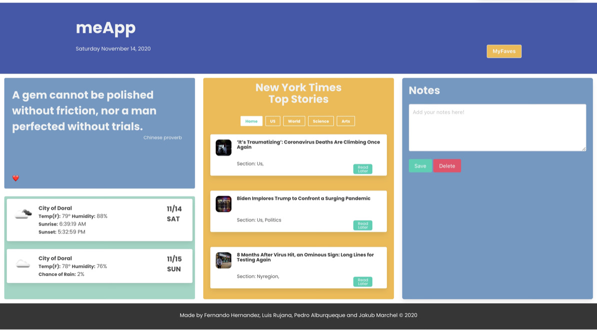

# meApp Project

## Made by Fernando Hernandez, Luis Rujana, Pedro Alburqueque and Jakub Marchel

## Conccept

### Description

An app that can display the current weather for the user’s current location as well as tomorrow’s forecasted weather. The app also provides a new random motivational quote along with the top New York Times articles which can than be sorted by “US”, “World”, “Science”, and “arts”. The app also provides a notes section in which the user can write and store notes. 

### User story

AS A bootcamp coding student who works full time with a busy schedule and who doesn’t want to switch between apps…
I WANT to get top stories, live weather, daily motivational quotes, and personal notes to plan and track my time effectively…
SO THAT I can get all the information quicker and plan my time more effectively

### Technologies used
HTML5, JavaScript 
JQuery
https://jquery.com/ 
CSS Framework - Bulma 
https://bulma.io/
Openweather API
https://openweathermap.org/
New York Times API
https://developer.nytimes.com/
Random Motivational Quotes
https://type.fit/api/quotes 

### App Screeshot

### Directions for Future Development

-Adding a feature where we can delete the stored quotes and articles and choose between which ones we want to delete. 

-Adding a feature in the Notes section to choose between which notes to delete.

-Provide a link when clicked on the weather to take you to a more indepth look at current weather and forecasted weather.

-Adding to the header/footer the makers of each API and giving them credit for same.

-Adjust icons for weather with new icons.
